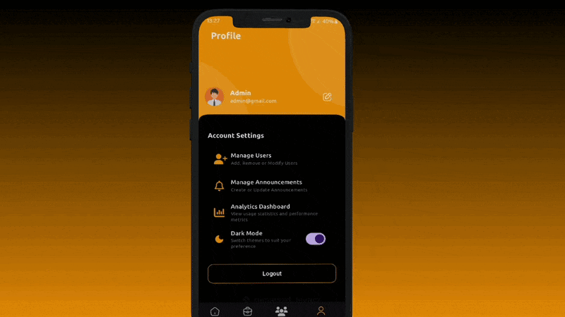

# 📱 AttendZone Admin App

A powerful Flutter-based attendance and team management app built for companies. The admin panel helps HRs and managers track attendance, view analytics, assign tasks, and communicate effectively with employees.

  
  

## 🚀 Features

- **📊 Home Dashboard**
  - Weekly attendance bar graph
  - Navigation to Present/Absent data pages
  - Filter by selected date

  
  

- **📢 Announcements**
  - Send announcements to users via chat-like interface
  - Users get real-time updates
    
  
  

- **📁 Project Management**
  - View all projects with:
    - Completion %
    - Priority
    - Status
    - Deadline

  


- **👥 User Management**
  - List of all registered users
  - View user details quickly

  
    

- **📈 Analytics Dashboard**
  - Weekly analytics summary
  - Detailed charts and breakdowns
    
  


- **🌙🌞 Dark Mode / Light Mode**
  - Seamless UI switching

- **👤 Profile Section**
  - User photo and email
  - Quick access to Analytics Dashboard

- **🔐 Logout Button**
  
  


## 📦 Tech Stack

- 🔧 Flutter (Admin App)
- 🗃 MongoDB
- 🌐 Node.js (Backend)
- 📡 REST API

## 📁 Folder Structure

```
lib/
├── Api/
├── common/
  ├── styles/
  ├── widgets/
├── functions/
├── graph/
├── models/
├── navigation_pages/
├── pages/
├── utils/
  ├── constants/
  ├── device/
  ├── helper_functions/
  ├── loaders/
  ├── popups/
  ├── theme/
    ├── custom_themes/
  ├── validators/
```

## 📬 Backend APIs
- The backend is built using Node.js and Express.js, and handles authentication, attendance tracking, announcements, project management, and analytics.

## 🛠 Setup

```bash
git clone https://github.com/IMMANUEL-88/az_admin.git
cd az_admin
flutter pub get
flutter run
```
**Note**: While you can clone and run the app locally, please be aware that the backend APIs are currently hosted on a local server (localhost). To test full functionality, you'll need to set up the backend environment separately.


